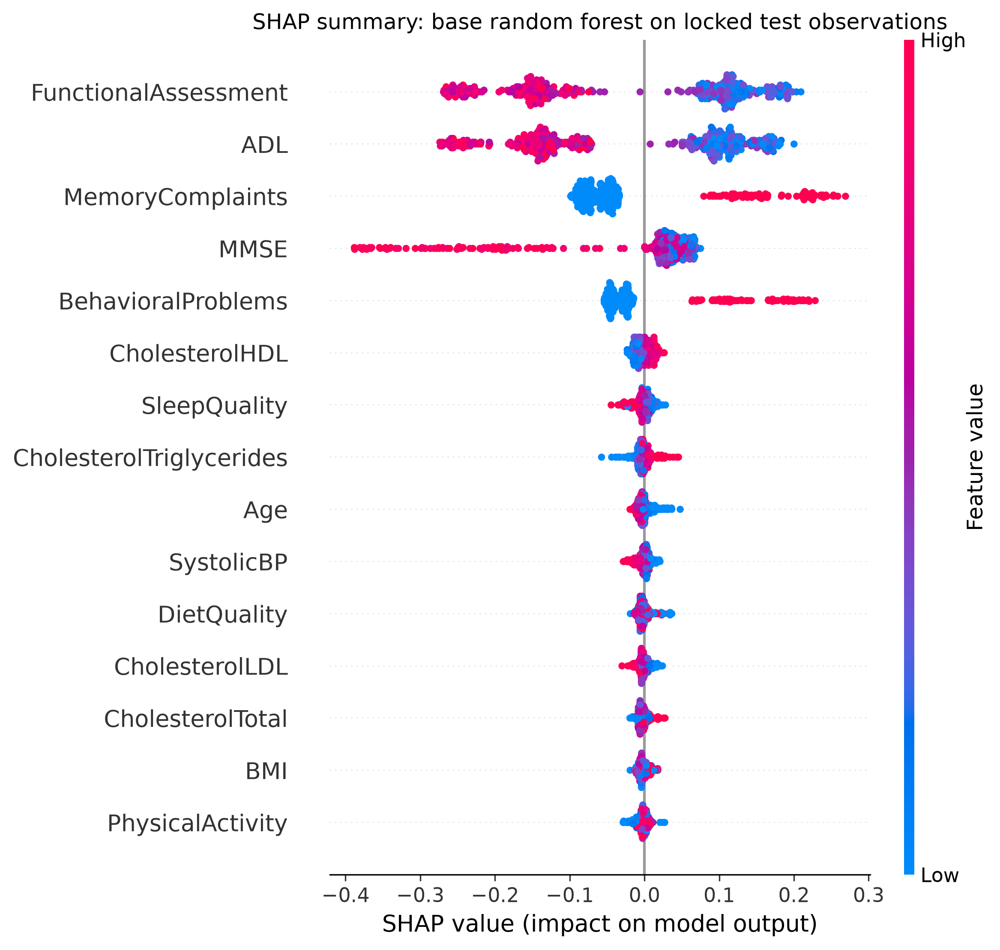

# Alzheimer’s Disease Classification with Machine Learning

A reproducible, leakage-aware machine-learning study comparing logistic regression and random forest on a synthetic Alzheimer’s disease dataset.

I built this project to do more than report a high accuracy score. The goal was to create an auditable end-to-end workflow that separates model development from final evaluation, measures both discrimination and calibration, checks for common sources of leakage, explains the fitted model, and states clearly what the results do—and do not—establish.

> **Important:** This project uses synthetic data and is intended for education and methodological research. It is **not** a clinical diagnostic system, medical device, risk calculator, or source of medical advice.

## What I did

I developed and documented the complete modeling workflow:

- prepared a tabular dataset containing **2,149 synthetic observations** and 35 source columns;
- excluded `PatientID` and the constant confidential field `DoctorInCharge` from modeling;
- created a stratified **80/20 development–test split** using random seed 42;
- kept preprocessing inside scikit-learn pipelines so transformations were fitted only on training data;
- compared two prespecified candidates: class-weighted logistic regression and class-weighted random forest;
- selected the random forest using development data only, without test-guided tuning;
- applied **five-fold sigmoid probability calibration** using development data only;
- locked the 430-observation test set until final evaluation;
- measured ROC-AUC, PR-AUC, accuracy, sensitivity, specificity, precision, NPV, F1, Brier score, log loss, and expected calibration error;
- calculated bootstrap confidence intervals for key final metrics;
- audited exact and near-duplicate overlap between development and test partitions;
- ran 25 shuffled-target experiments as a pipeline sanity check;
- generated global permutation importance and SHAP explanations;
- built an educational Streamlit interface;
- produced a full manuscript, validation report, machine-readable audit, figures, and citation-verification report.

## What the study established

### 1. Random forest was the stronger of the two tested candidates

Five-fold cross-validation on the development set showed better performance for the random forest than for logistic regression across the main predictive metrics.

| Model | ROC-AUC | PR-AUC | Accuracy | Sensitivity | Specificity | F1 | Brier score |
|---|---:|---:|---:|---:|---:|---:|---:|
| Logistic regression | 0.903 ± 0.014 | 0.846 ± 0.033 | 0.823 ± 0.020 | 0.814 ± 0.033 | 0.827 ± 0.046 | 0.765 ± 0.015 | 0.123 ± 0.015 |
| Random forest | **0.955 ± 0.011** | **0.935 ± 0.020** | **0.952 ± 0.009** | **0.913 ± 0.024** | **0.973 ± 0.015** | **0.930 ± 0.012** | **0.087 ± 0.005** |

This establishes superiority only within the project’s **prespecified two-model comparison**. It does not show that random forest is better than every other possible algorithm.

### 2. The locked model performed strongly on the internal synthetic test set

The final model was a five-fold sigmoid-calibrated random forest evaluated once on a locked test set of 430 observations.

| Metric | Locked test result |
|---|---:|
| ROC-AUC | **0.941** (95% CI 0.909–0.969) |
| PR-AUC / average precision | **0.922** (95% CI 0.873–0.962) |
| Accuracy | **0.951** |
| Sensitivity / recall | **0.921** |
| Specificity | **0.968** |
| Precision / PPV | **0.940** |
| Negative predictive value | **0.957** |
| F1 score | **0.930** |
| Brier score | **0.053** (95% CI 0.037–0.072) |
| Log loss | **0.229** |
| Expected calibration error | **0.050** |

At the fixed, non-optimized threshold of 0.5, the confusion matrix contained:

- **269** true negatives
- **9** false positives
- **12** false negatives
- **140** true positives

<p align="center">
  
  
</p>

<p align="center">
  
  
</p>

### 3. The result survived several software-level validity checks

The audit established that:

- the reconstructed test split matched the stored test features and labels exactly;
- the test set was not used for preprocessing, model selection, calibration, threshold selection, or tuning;
- the saved model hash was unchanged before and after final validation;
- no exact predictor duplicates crossed the development/test boundary;
- no cross-split near duplicates met the prespecified normalized-distance threshold;
- no source predictor rows were duplicated;
- performance collapsed toward chance after label permutation: mean shuffled-target ROC-AUC was **0.508 ± 0.056** across 25 runs.

These checks support the integrity of the implemented evaluation pipeline. They do not establish independence or validity beyond the available synthetic data.

### 4. Cognitive and functional variables dominated model attribution

The five largest mean absolute SHAP attributions were:

1. `FunctionalAssessment`
2. `ADL`
3. `MemoryComplaints`
4. `MMSE`
5. `BehavioralProblems`

<p align="center">
  
</p>

This pattern is descriptively consistent with the synthetic target, but it must not be interpreted causally. These variables are close to how cognitive impairment is assessed and may encode assumptions used by the data generator. The SHAP analysis explains the underlying uncalibrated random-forest score structure, not the sigmoid calibration layer.

## What the project does not establish

The results do **not** establish:

- clinical diagnostic validity;
- performance on real patients;
- transportability across hospitals, populations, or measurement systems;
- fairness across demographic groups;
- safety or clinical utility;
- causal relationships between features and Alzheimer’s disease;
- an optimal clinical decision threshold.

The source is a single synthetic dataset, and several important predictors may be proxies for the synthetic diagnosis-generation process. External validation on provenance-audited, real-world cohorts—with predictor timing defined before the diagnostic decision—would be required before any clinical interpretation.

## Methodology at a glance

```text
Synthetic dataset (n = 2,149)
│
├── Development set (n = 1,719)
│   ├── preprocessing fitted inside each training fold
│   ├── logistic regression vs. random forest
│   ├── five-fold cross-validation
│   └── five-fold sigmoid calibration of selected model
│
└── Locked test set (n = 430)
    ├── final discrimination and classification metrics
    ├── calibration assessment
    ├── bootstrap confidence intervals
    ├── duplicate and near-duplicate audit
    ├── shuffled-target sanity analysis
    └── permutation importance and SHAP explanation
```

### Preprocessing

- Numeric features: median imputation and standardization
- Categorical features: most-frequent imputation and one-hot encoding
- Unknown categories: handled by the encoder
- Identifier/confidential metadata: removed before modeling

### Candidate models

- **Logistic regression:** balanced class weights, maximum 2,000 iterations
- **Random forest:** 500 trees, minimum leaf size 3, balanced class weights, seed 42

No grid search, random search, or test-guided hyperparameter optimization was performed.

## Reproduce the project

### 1. Create an environment

```bash
python -m venv .venv
source .venv/bin/activate
pip install -r requirements.txt
```

### 2. Download the dataset

The downloaded CSV is intentionally excluded from version control. Obtain Rabie El Kharoua’s synthetic [Alzheimer’s Disease Dataset](https://www.kaggle.com/datasets/rabieelkharoua/alzheimers-disease-dataset) under its stated CC BY 4.0 terms.

Using an authenticated [Kaggle CLI](https://github.com/Kaggle/kaggle-api):

```bash
mkdir -p data/raw
kaggle datasets download \
  -d rabieelkharoua/alzheimers-disease-dataset \
  -p data/raw \
  --unzip
```

The expected file path is:

```text
data/raw/alzheimers_disease_data.csv
```

### 3. Train and evaluate

Run commands from the repository root:

```bash
python -m src.train
python -m src.evaluate
python -m src.explain
python -m src.shap_report
python -m src.validate
```

The trained `models/model.joblib` artifact is reproducible and intentionally excluded from Git. Metrics, tables, and figures are written under `results/`.

### 4. Run the tests

```bash
pytest -q
```

### 5. Launch the educational app

```bash
streamlit run app/app.py
```

The interface is a demonstration of model inference only and is clearly labeled as non-clinical.

## Repository structure

```text
alzheimers-ml-project/
├── app/                         Streamlit demonstration
├── data/
│   ├── raw/                     downloaded dataset (ignored)
│   └── processed/               derived datasets (ignored)
├── models/                      generated model artifacts (ignored)
├── notebooks/                   exploratory analysis
├── paper/
│   ├── manuscript.md            full research manuscript
│   ├── final_validation_report.md
│   ├── verification_report.md   empirical and citation audit
│   └── references/              dataset citation metadata
├── results/
│   ├── figures/                 ROC, PR, calibration, SHAP, and audit plots
│   ├── metrics/                 machine-readable evaluation results
│   └── tables/                  CV, importance, and audit tables
├── src/
│   ├── data.py                  loading and leakage exclusions
│   ├── preprocessing.py         fitted preprocessing pipeline
│   ├── train.py                 candidate comparison and final training
│   ├── evaluate.py              test metrics and plots
│   ├── explain.py               permutation importance
│   ├── shap_report.py           SHAP analysis
│   └── validate.py              locked-model audit
├── tests/                       pipeline smoke tests
├── requirements.txt
└── README.md
```

## Main evidence artifacts

- [`paper/manuscript.md`](paper/manuscript.md) — complete study report and literature context
- [`paper/final_validation_report.md`](paper/final_validation_report.md) — authoritative locked-model audit
- [`paper/verification_report.md`](paper/verification_report.md) — empirical consistency and citation verification
- [`results/metrics/final_validation.json`](results/metrics/final_validation.json) — machine-readable final audit
- [`results/tables/candidate_cross_validation.csv`](results/tables/candidate_cross_validation.csv) — candidate comparison
- [`results/tables/shap_importance.csv`](results/tables/shap_importance.csv) — ranked model attributions
- [`results/tables/permutation_sanity.csv`](results/tables/permutation_sanity.csv) — shuffled-target results

## Data source and citation

Dataset:

> El Kharoua, R. (2024). *Alzheimer’s Disease Dataset*. Kaggle. https://doi.org/10.34740/KAGGLE/DSV/8668279

The dataset citation is also available in [`paper/references/dataset.bib`](paper/references/dataset.bib). The repository retains aggregate results and reproducibility documentation while excluding the downloaded source CSV.

## Responsible-use statement

This repository demonstrates a rigorous internal-validation workflow on synthetic data. Any future extension toward clinical research should begin with a new protocol, independently sourced real-world data, provenance and measurement-timing review, subgroup/fairness analysis, external validation, and clinically justified decision thresholds. The current test set has already been examined and must not be reused to justify model revisions.
