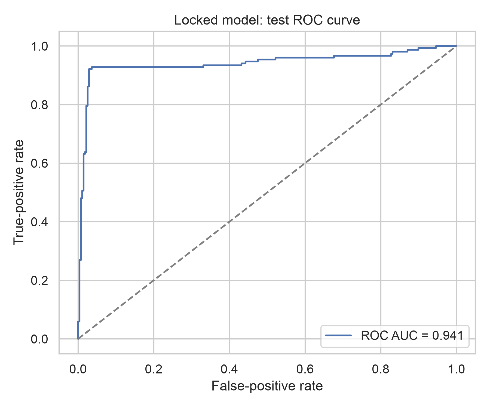
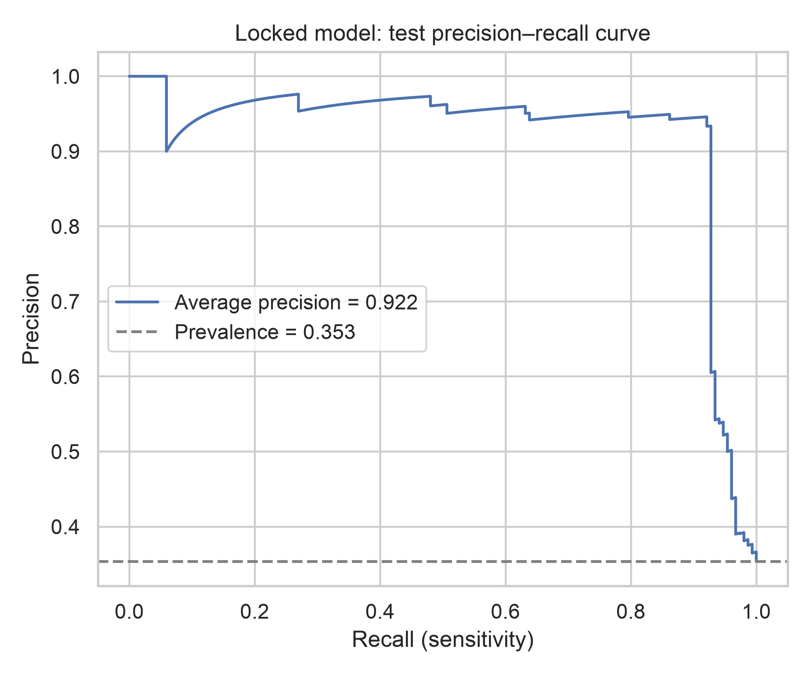
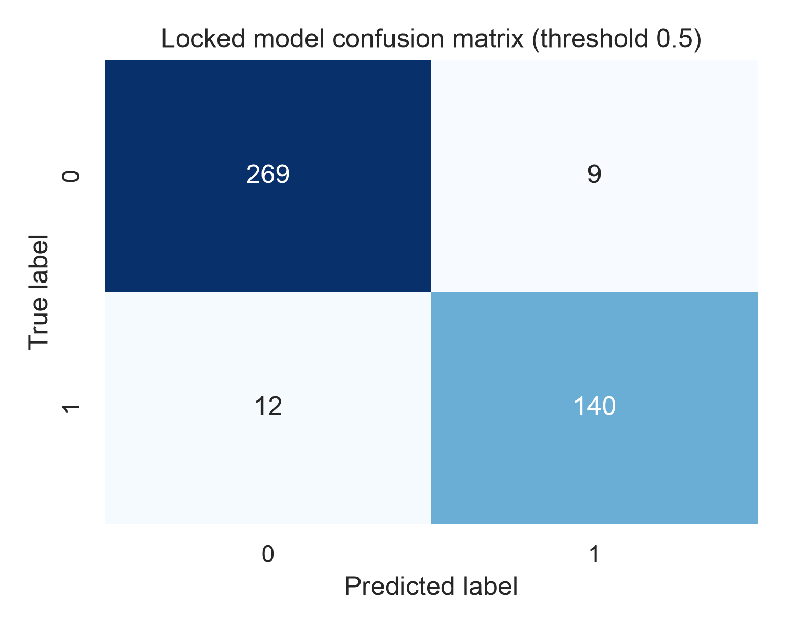
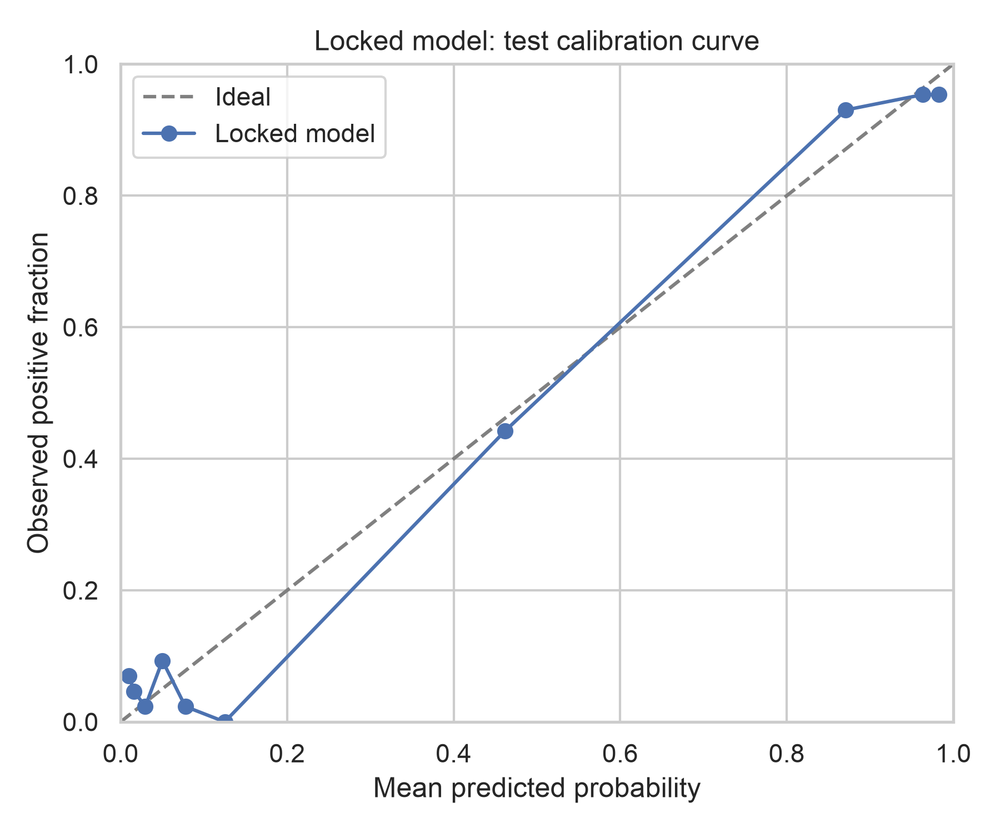
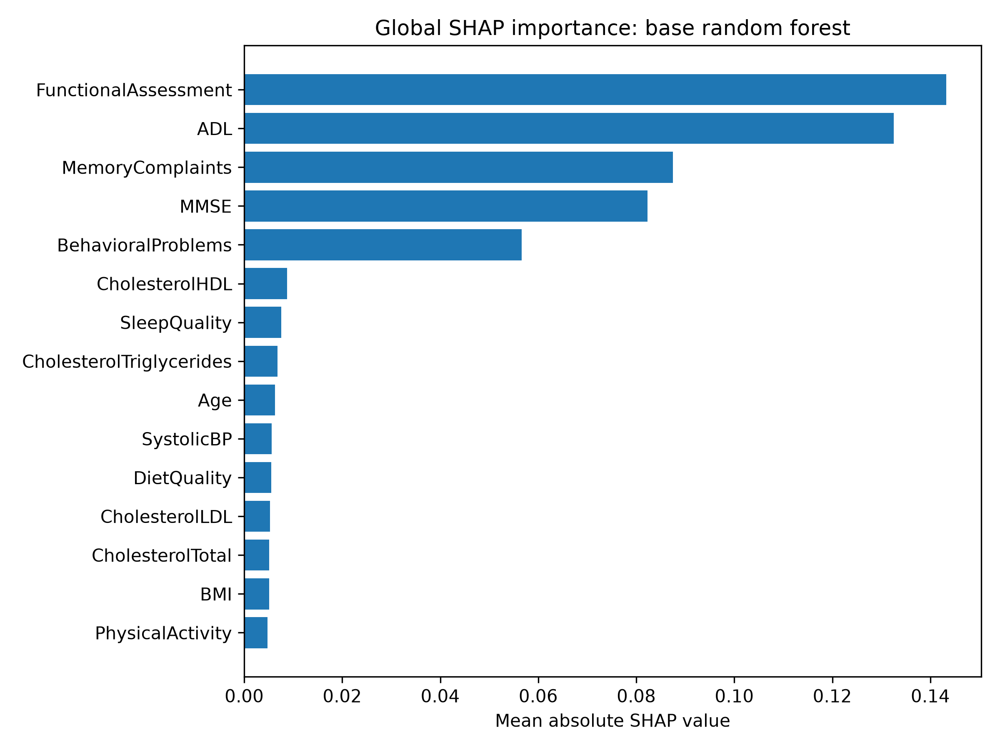

# Reproducible Machine-Learning Classification in a Synthetic Alzheimer’s Disease Dataset: An Internal Validation Study

## Abstract

**Background:** Machine-learning studies of Alzheimer’s disease require clear separation between software-level predictive performance and evidence of clinical validity. Synthetic datasets can support reproducible method development, but performance on generated observations may reflect the data generator rather than real clinical heterogeneity.

**Objective:** To evaluate a prespecified, leakage-aware binary-classification workflow in a synthetic Alzheimer’s disease dataset while preserving a locked test set and explicitly limiting claims to internal validation.

**Methods:** The dataset contained 2,149 observations, including 760 positive diagnoses (35.4%). A stratified split assigned 1,719 observations to development and 430 to a locked test set. `PatientID` and `DoctorInCharge` were excluded. Two fixed candidate specifications—class-weighted logistic regression and class-weighted random forest—were compared; no hyperparameter optimization was performed. Development-set five-fold cross-validation characterized candidate performance. The final model was a random forest with five-fold, development-only sigmoid calibration. The test set was isolated from model selection, preprocessing fitting, calibration, tuning, and threshold selection. Final discrimination, classification, and calibration were evaluated at the fixed threshold of 0.5. Post-hoc checks included bootstrap confidence intervals, duplicate and near-duplicate audits, a target-shuffle sanity analysis, permutation importance, and SHAP.

**Results:** Development cross-validation ROC-AUC was 0.955 ± 0.011 for random forest and 0.903 ± 0.014 for logistic regression. On the locked test set, the calibrated random forest achieved ROC-AUC 0.9408 (95% bootstrap CI 0.9093–0.9694), PR-AUC 0.9222 (0.8732–0.9624), accuracy 0.9512, sensitivity 0.9211, specificity 0.9676, precision 0.9396, negative predictive value 0.9573, F1 0.9302, Brier score 0.0532 (0.0366–0.0717), log loss 0.2293, and expected calibration error 0.0499. The confusion matrix comprised 269 true negatives, 9 false positives, 12 false negatives, and 140 true positives. No source predictor duplicates, exact development/test duplicates, or prespecified near duplicates were identified. Mean target-shuffle ROC-AUC was 0.508 ± 0.056. SHAP ranked `FunctionalAssessment`, `ADL`, `MemoryComplaints`, `MMSE`, and `BehavioralProblems` highest, with a marked importance gap after the fifth feature.

**Conclusions:** The locked random-forest pipeline showed strong internal performance in this synthetic benchmark and outperformed logistic regression only within the prespecified two-model candidate set. These findings do not establish diagnostic accuracy, transportability, safety, utility, or clinical validity. External evaluation in provenance-audited real-world cohorts is required before any clinical interpretation.

## Keywords

Alzheimer’s disease; machine learning; random forest; internal validation; synthetic data; calibration; SHAP; data leakage; reproducibility; clinical prediction model

## Introduction

Alzheimer’s disease is clinically expressed through progressive cognitive decline that interferes with everyday function. Contemporary diagnostic criteria integrate history, cognitive assessment, functional impairment, examination, and—where available and appropriate—biomarker evidence [1]. The Mini-Mental State Examination (MMSE) is a long-established brief measure of cognitive state [2]. In machine-learning research, such cognitive and functional measurements are frequently combined with demographic, lifestyle, medical-history, imaging, or biomarker information to classify disease status or predict progression [3].

High reported accuracy is not sufficient evidence that a clinical prediction model is useful. Transparent reporting requires a clear target population and outcome, explicit predictor handling, reproducible validation, and evaluation of both discrimination and calibration [4]. Risk-of-bias frameworks likewise emphasize participant selection, predictor and outcome definition, and analysis procedures, including protection against overfitting and leakage [5]. A systematic review found that high risk of bias was common in supervised machine-learning prediction-model studies, particularly because of analysis limitations [6]. These concerns are especially important for diagnostic classification, where leakage, duplicate subjects, non-independent partitions, or preprocessing conducted before splitting can produce optimistic estimates [14].

Internal and external validation answer different questions. Internal validation estimates performance under resampling or held-out sampling from the available data-generating process. External validation evaluates a model in independent data and is necessary to assess transportability across settings, populations, and measurement processes [7]. Calibration—the agreement between predicted probabilities and observed outcome frequencies—must be assessed separately from discrimination because a model can rank observations well while producing unreliable probabilities [8]. Precision–recall analysis is also informative when the positive class is less frequent because it focuses on precision and sensitivity rather than the true-negative-dominated false-positive rate [9].

Synthetic data can facilitate reproducible experimentation and avoid direct exposure of patient records, but it introduces a distinct inferential constraint: learned associations may primarily recover assumptions embedded in the generator. Synthetic health data therefore require explicit assessment of utility and fidelity, and performance in synthetic observations cannot be equated with clinical validity [15].

This study evaluates a locked machine-learning workflow using a publicly distributed synthetic Alzheimer’s disease dataset [17]. The aims were to (1) document a reproducible and leakage-aware development process; (2) compare only the two prespecified candidate models, logistic regression and random forest; (3) report discrimination, classification, and calibration on a locked test set; and (4) characterize software-level safeguards and post-hoc model behavior without altering the locked model. The study makes no claim of clinical diagnostic validity.

## Related Work/Literature Review

### Machine learning for Alzheimer’s disease classification

Machine-learning research in Alzheimer’s disease has often focused on neuroimaging and multimodal classification. Jo, Nho, and Saykin reviewed deep-learning studies for diagnostic classification and prognostic prediction using neuroimaging and highlighted both potential and recurring constraints related to sample size, independent validation, and generalizability [3]. The present work differs in purpose and evidentiary scope: it uses a small synthetic tabular dataset as a reproducibility and internal-validation benchmark rather than attempting to establish a neuroimaging biomarker or a clinically deployable diagnostic system.

Cognitive and functional predictors warrant careful interpretation. MMSE was developed as a practical cognitive grading instrument [2], and impaired daily function is part of the clinical distinction between dementia and less severe cognitive impairment [1]. Thus, dominance of cognitive and functional variables in a classifier may be clinically coherent. However, in synthetic data these same variables may be direct ingredients of the target-generation rule. Apparent face validity does not exclude construct or proxy leakage, and model attribution cannot establish whether a predictor causes, precedes, or merely encodes the assigned diagnosis.

### Prediction-model reporting, validation, and risk of bias

TRIPOD+AI provides updated reporting guidance for prediction models developed with regression or machine-learning methods [4]. PROBAST+AI provides a structured approach to appraising quality, risk of bias, and applicability [5]. These frameworks motivate explicit reporting of the data source, participants, outcome, predictors, sample partitioning, preprocessing, model specification, calibration, performance measures, and limitations. They also reinforce the distinction between model development and evaluation.

External validation is more than a second random split from the same source. Collins and colleagues showed that the conduct and reporting of external validations have historically been inconsistent and stressed the need for independent evaluation with adequate methods [7]. In the present study, the held-out test set is an internal test partition because it originates from the same synthetic source as the development data. It provides a useful final software-level check but does not test transportability.

### Random forests, calibration, and evaluation metrics

Random forests aggregate randomized decision trees and can represent nonlinear effects and interactions without prespecifying their functional form [10]. This flexibility can be useful for tabular data but also makes post-hoc explanation important. Logistic regression was retained as a simpler comparator. The candidate set was intentionally narrow and fixed in code; the study does not claim comparison against the broader model landscape.

Raw classifier scores are not automatically reliable probabilities. Sigmoid calibration, commonly associated with Platt-style scaling, has been evaluated as a post-hoc approach for supervised classifiers [11]. In this project, calibration was performed only within the development set using five-fold cross-validation. Evaluation therefore included ROC-AUC and PR-AUC for discrimination, threshold-dependent classification metrics, log loss, Brier score, an empirical calibration curve, and expected calibration error. Van Calster and colleagues recommend that calibration receive the same attention as discrimination in predictive analytics [8]. Saito and Rehmsmeier showed why precision–recall plots can be more informative than ROC plots for imbalanced binary outcomes [9].

### Explainability, leakage, and synthetic data

SHAP provides additive feature attributions based on Shapley-value concepts [12]. Tree-specific methods extend local attributions to global summaries for tree ensembles [13]. SHAP describes how a fitted model distributes its output among observed features under the explainer’s assumptions; it does not identify causal effects, clinical mechanisms, or intervention targets.

Leakage can enter through data collection, partitioning, preprocessing, feature engineering, or target-proximal variables [14]. This study addresses direct identifier leakage and cross-partition duplicates, and it keeps preprocessing inside fitted pipelines. It cannot resolve whether clinically proximal predictors were defined before, during, or after the synthetic diagnosis assignment because source-level measurement timing and generator logic are not available. Synthetic-data scholarship similarly cautions that privacy, fidelity, utility, and downstream validity are separate properties [15]. The present manuscript therefore treats the dataset as an educational benchmark and constrains all empirical claims to the observed synthetic cohort.

## Materials and Methods

### Study design and evidence governance

This was a retrospective internal-validation study of a binary classifier in a synthetic tabular dataset. No new experiment was run for manuscript preparation, and the trained artifact, model specification, empirical tables, metrics, and figures were not changed. Empirical statements were derived only from the project source code and locked outputs: `src/*.py`, `results/metrics/final_validation.json`, `results/metrics/shap_metadata.json`, `results/tables/*`, `paper/final_validation_report.md`, and existing figures.

The research-writing process followed the conceptual stages of literature collection, screening, synthesis, drafting, peer-style claim review, and citation verification. Five supplied NotebookLM notebooks were used as private research guidance, not as citable authorities. Candidate references suggested by those notebooks were screened independently against authoritative publisher pages, PubMed/PMC records, society proceedings, or established journal pages. Unverifiable and notebook-only references were excluded. Citation verification is documented in `paper/verification_report.md`.

### Dataset and outcome

The Alzheimer’s Disease Dataset by El Kharoua is described by its data card as synthetic and educational [17]. The local source file contained 2,149 observations and 35 columns, with no missing cells and no exact duplicate rows. The binary target was `Diagnosis`; 760 observations were positive (35.4%) and 1,389 were negative. Predictor domains included demographics, lifestyle, medical history, physiological measurements, cognitive assessment, functional assessment, and reported symptoms.

`Diagnosis` was excluded as the outcome. `PatientID` was excluded because it was a unique record identifier. `DoctorInCharge` was excluded because it was constant confidential metadata (`XXXConfid`) and non-predictive. The remaining 32 source predictor columns were used. No included feature was exactly identical to the target.

### Data partitioning and lock policy

All stochastic operations used random seed 42. A stratified 80/20 split assigned 1,719 observations to development and 430 to the locked test set. The development set contained 608 positives and 1,111 negatives; the test set contained 152 positives and 278 negatives. For the original candidate selection, the development data were divided again into an initial model-fit subset of 1,375 observations and an internal selection-validation subset of 344 observations, preserving class proportions.

The test partition was not supplied to preprocessing fitting, candidate selection, calibration, hyperparameter tuning, or threshold selection. The validation audit reconstructed the split and matched the stored test features and labels exactly. The model artifact had the same SHA-256 hash before and after final validation (`6d6b1ad1274d917d4cd4a169412ba369e4848505729d6124788a8768a86e6cd7`). Once test results were examined, the test set was considered permanently spent for model-development decisions.

### Preprocessing

Preprocessing was implemented with scikit-learn pipelines [16]. Numeric variables were median-imputed and standardized. `Gender`, `Ethnicity`, and `EducationLevel` were treated as categorical; they were imputed with the most frequent category and one-hot encoded with unknown-category handling. Although the local dataset had no missing cells, imputation was retained as a reproducible pipeline safeguard. All preprocessing parameters were fitted within the corresponding training data or cross-validation fold.

### Candidate models and selection

Two and only two candidate specifications were evaluated:

1. **Logistic regression:** maximum 2,000 iterations and balanced class weights.
2. **Random forest:** 500 trees, minimum leaf size 3, balanced class weights, random seed 42, and parallel execution.

No hyperparameter optimization, grid search, random search, or test-guided tuning was performed. The original internal selection-validation ROC-AUC favored random forest (0.9496) over logistic regression (0.8950). The selected random forest was then refitted on the combined development data for explanation. The final predictive model used a newly instantiated random-forest pipeline calibrated by `CalibratedClassifierCV` with sigmoid calibration, five folds, `ensemble=True`, and development data only. This procedure produced an ensemble of five calibrated pipelines.

Five-fold stratified cross-validation with shuffling and seed 42 was subsequently used on the full development set to characterize the two prespecified candidates more stably. Preprocessing occurred within each training fold. This cross-validation summarized, but did not modify, the locked model.

### Final test evaluation

The final calibrated model generated probabilities for the 430 test observations. Binary predictions used the fixed threshold of 0.5 inherited from the classifier’s default decision rule. No data-driven threshold search was conducted.

Performance measures included ROC-AUC; PR-AUC, calculated as average precision; accuracy; sensitivity; specificity; precision/positive predictive value; negative predictive value; F1 score; Brier score; log loss; and expected calibration error (ECE). ECE used ten equal-width probability bins and is reported as a descriptive, bin-dependent statistic. The displayed calibration curve used ten quantile bins and therefore should not be interpreted as the same estimator as equal-width-bin ECE.

Percentile-bootstrap 95% confidence intervals for ROC-AUC, PR-AUC, and Brier score used 2,000 resamples drawn with replacement and random seed 42. Bootstrap draws containing only one outcome class were omitted from the bootstrap analysis.

### Leakage, duplication, and sanity analyses

The direct leakage audit confirmed that `PatientID` and `DoctorInCharge` were absent from the artifact feature list and that no included feature equaled `Diagnosis`. To evaluate partition overlap, exact predictor duplicates across development and test sets were counted. Near duplicates were prespecified as a mean absolute distance of 0.01 or less after min–max scaling all included predictors; this normalized-distance check was an audit only and was not used to fit the model.

A target-shuffle sanity analysis independently permuted development labels 25 times, fitted the same selected random-forest specification to each shuffled development target, and evaluated each sanity model against the unchanged test labels. These auxiliary models neither replaced nor altered the locked final artifact.

### Model explanation

Global permutation importance measured the decrease in test ROC-AUC after shuffling each source feature, repeated 30 times. SHAP used `shap.TreeExplainer` on the **uncalibrated selected random forest refitted on the development set**, applied to transformed locked-test observations. Mean absolute SHAP values summarized global attribution magnitude. Because the production artifact is an ensemble of five sigmoid-calibrated pipelines, these SHAP values explain the underlying single random-forest explanation pipeline, not the calibration layer or the ensemble’s final probability mapping. Neither permutation importance nor SHAP was used for feature selection or model revision.

### Ethics and intended use

The project used a public synthetic dataset and contained no real patient records according to the data description. No clinical intervention, prospective evaluation, or human-subject inference was performed. The model is not intended for diagnosis, screening, triage, treatment, or patient counseling.

## Results

### Cohort composition and data checks

The full synthetic dataset comprised 2,149 observations, of which 760 (35.4%) were positive. Table 1 summarizes the analysis partitions. No missing cells or exact duplicate source rows were reported.

**Table 1. Sample composition.**

| Partition | Total, n | Negative, n | Positive, n | Positive prevalence |
|---|---:|---:|---:|---:|
| Full dataset | 2,149 | 1,389 | 760 | 35.4% |
| Development | 1,719 | 1,111 | 608 | 35.4% |
| Initial model-fit subset | 1,375 | 889 | 486 | 35.3% |
| Selection-validation subset | 344 | 222 | 122 | 35.5% |
| Locked test | 430 | 278 | 152 | 35.3% |

Source artifacts: [`results/tables/dataset_summary.csv`](../results/tables/dataset_summary.csv) and [`results/metrics/final_validation.json`](../results/metrics/final_validation.json).

### Candidate-model comparison

In five-fold development-set cross-validation, random forest achieved ROC-AUC 0.9548 ± 0.0106, compared with 0.9031 ± 0.0142 for logistic regression. Random forest also had higher PR-AUC, accuracy, sensitivity, precision, and F1, and a lower Brier score within this two-model candidate set (Table 2). These results support the prespecified selection but do not establish superiority to models that were not evaluated.

**Table 2. Five-fold stratified cross-validation in the development set (mean ± SD).**

| Candidate | ROC-AUC | PR-AUC | Accuracy | Sensitivity | Specificity | Precision | F1 | Brier score |
|---|---:|---:|---:|---:|---:|---:|---:|---:|
| Logistic regression | 0.903 ± 0.014 | 0.846 ± 0.033 | 0.823 ± 0.020 | 0.814 ± 0.033 | 0.827 ± 0.046 | 0.724 ± 0.044 | 0.765 ± 0.015 | 0.123 ± 0.015 |
| Random forest | 0.955 ± 0.011 | 0.935 ± 0.020 | 0.952 ± 0.009 | 0.913 ± 0.024 | 0.973 ± 0.015 | 0.950 ± 0.026 | 0.930 ± 0.012 | 0.087 ± 0.005 |

Complete values: [`results/tables/candidate_cross_validation.csv`](../results/tables/candidate_cross_validation.csv).

### Locked test-set performance

At threshold 0.5, the final five-fold sigmoid-calibrated random forest achieved ROC-AUC 0.9408 (95% bootstrap CI 0.9093–0.9694) and PR-AUC 0.9222 (0.8732–0.9624). Accuracy was 0.9512, sensitivity 0.9211, specificity 0.9676, precision 0.9396, negative predictive value 0.9573, and F1 0.9302. The Brier score was 0.0532 (0.0366–0.0717), log loss 0.2293, and ten-equal-width-bin ECE 0.0499 (Table 3).

**Table 3. Locked test-set performance (n = 430).**

| Domain | Measure | Estimate | 95% bootstrap CI |
|---|---|---:|---:|
| Discrimination | ROC-AUC | 0.9408 | 0.9093–0.9694 |
| Discrimination | PR-AUC / average precision | 0.9222 | 0.8732–0.9624 |
| Classification | Accuracy | 0.9512 | — |
| Classification | Sensitivity | 0.9211 | — |
| Classification | Specificity | 0.9676 | — |
| Classification | Precision / PPV | 0.9396 | — |
| Classification | Negative predictive value | 0.9573 | — |
| Classification | F1 score | 0.9302 | — |
| Probabilistic accuracy | Brier score | 0.0532 | 0.0366–0.0717 |
| Probabilistic accuracy | Log loss | 0.2293 | — |
| Calibration | ECE, 10 equal-width bins | 0.0499 | — |

The ROC and precision–recall curves are shown in Figures 1 and 2. The test positive prevalence was 0.3535, shown as the reference baseline in the precision–recall figure.

**Figure 1.** Receiver-operating-characteristic curve for the locked calibrated model on the test set.

**Figure 2.** Precision–recall curve for the locked calibrated model; the dashed reference denotes positive prevalence.

The confusion matrix contained 269 true negatives, 9 false positives, 12 false negatives, and 140 true positives (Figure 3).

**Figure 3.** Confusion matrix at the fixed, non-optimized threshold of 0.5.

The calibration curve is shown in Figure 4. Its ten quantile bins provide a descriptive view only; the Brier score and ECE quantify different aspects of probabilistic performance, and ECE depends on binning.

**Figure 4.** Reliability diagram using ten quantile bins.

### Leakage, duplication, and sanity findings

No predictor row was duplicated in the source feature matrix. No exact predictor duplicate crossed the development/test boundary, and no cross-partition near duplicate met the prespecified normalized-distance threshold. The minimum mean normalized cross-split distance was 0.0825 and the median nearest distance was 0.1476, both above the near-duplicate cutoff of 0.01. These results reduce concern about direct record duplication but do not prove patient independence or prospective measurement order in a synthetic dataset.

Across 25 independently shuffled development targets, mean test ROC-AUC was 0.508 ± 0.056 and mean PR-AUC was 0.369 ± 0.040. The collapse of ROC-AUC toward chance supports the conclusion that the observed locked-model discrimination was not a generic artifact of the implementation producing high scores for random labels.

### Model explanations

SHAP ranked `FunctionalAssessment` (mean absolute SHAP 0.1432), `ADL` (0.1326), `MemoryComplaints` (0.0875), `MMSE` (0.0823), and `BehavioralProblems` (0.0566) as the five leading transformed features. The sixth-ranked feature, `CholesterolHDL`, had mean absolute SHAP 0.0088, demonstrating a marked importance gap after the top five. Permutation importance independently placed the same five source variables first, followed by much smaller changes in ROC-AUC for the remaining variables.

**Figure 5.** Mean absolute SHAP values for the uncalibrated selected random forest refitted on development data and evaluated on locked-test observations. The plot does not explain the sigmoid calibration layer.

Complete SHAP results are available in [`results/tables/shap_importance.csv`](../results/tables/shap_importance.csv); permutation results are in [`results/tables/permutation_importance.csv`](../results/tables/permutation_importance.csv).

## Discussion

### Principal findings

The prespecified random forest showed strong internal predictive performance in the synthetic cohort. Its development-set cross-validation ROC-AUC was 0.955, and its locked-test ROC-AUC was 0.941. The 0.014 absolute difference is modest, while the test confidence interval reflects uncertainty from only 430 observations and 152 positive cases. At the fixed threshold of 0.5, sensitivity exceeded 0.92 and specificity exceeded 0.96, with 21 total misclassifications. The Brier score, log loss, ECE, and reliability diagram supplement discrimination by describing probability quality.

The random forest outperformed logistic regression **only within the prespecified candidate set**. This wording is essential. No other algorithm was evaluated, no hyperparameter search was conducted, and the results do not support claims that random forest is generally optimal for Alzheimer’s disease classification or synthetic tabular data. The simpler comparator nevertheless achieved a high development ROC-AUC of 0.903, indicating that substantial signal was available even under a linear log-odds formulation.

### Cognitive and functional predictor dominance

Both SHAP and permutation importance concentrated model behavior in five cognitive, functional, and symptom variables: functional assessment, activities of daily living, memory complaints, MMSE, and behavioral problems. Their dominance is qualitatively compatible with the clinical role of cognition and daily function in dementia assessment [1,2]. However, the observed ordering is a property of this fitted model and synthetic sample, not a clinical ranking of disease determinants.

The importance distribution also showed a conspicuous gap after the top five. The fifth mean absolute SHAP value was 0.0566, whereas the sixth was 0.0088; permutation importance similarly fell from 0.0479 for `BehavioralProblems` to 0.0011 for `CholesterolLDL`. This pattern suggests that most separability in the synthetic test data was concentrated in a small group of clinically proximal variables, while the remaining demographic, lifestyle, and physiological features contributed comparatively little to the model’s ranking performance.

### Why strong performance may be easy in the synthetic generator

The concentration of importance in clinically proximal variables offers a plausible explanation for the high internal performance: the synthetic generator may assign the diagnosis using relatively direct rules involving cognitive and functional features. If so, random forest can recover those nonlinear rules effectively, and a random held-out subset drawn from the same generator will preserve them. The absence of exact and near duplicates argues against simple row copying, and the target-shuffle analysis argues against a pipeline that yields high AUC under random labels. Neither check, however, tests whether the generated feature–outcome relationships resemble real clinical populations.

The dataset does not provide sufficient provenance to establish measurement timing. `FunctionalAssessment`, `ADL`, `MMSE`, `MemoryComplaints`, and `BehavioralProblems` might represent information collected before diagnosis, components used during diagnosis, or variables generated conditional on the assigned diagnosis. This unresolved construct/proxy leakage risk limits interpretation even though direct identifier and target leakage were addressed.

### Explainability does not imply causality

SHAP was useful for auditing which variables most influenced the underlying random forest, but the attributions are not causal estimates [12–14]. A positive or negative attribution does not show that changing a feature would change disease status, nor does it establish a biological mechanism. Correlated features can redistribute attribution, and a synthetic generator can create stable but artificial associations. Furthermore, the SHAP analysis explains the single uncalibrated development-refit random forest. It does not explain the five sigmoid calibration maps or the final calibrated ensemble probability. The figure and interpretation are therefore explicitly limited to the underlying random-forest score structure.

### Internal performance is not clinical validity

This study demonstrates reproducible software behavior and internally held-out performance, not clinical validity. The locked test set came from the same synthetic source as the development data. It cannot establish representative sampling, diagnostic-reference quality, temporal validity, fairness, robustness to missingness or distribution shift, transportability, patient benefit, or safe clinical thresholds. Strong ROC-AUC in this setting does not authorize use for screening, diagnosis, triage, treatment, or counseling.

The threshold of 0.5 was fixed and not optimized. This protects against threshold overfitting but does not make 0.5 clinically appropriate. A clinically meaningful threshold would require a prespecified intended use, explicit consequences of false positives and false negatives, relevant disease prevalence, and decision-analytic evaluation in real data. Decision-curve analysis was not performed because the synthetic dataset does not define a defensible intervention, utility function, or threshold range.

### Required next steps and preservation of the lock

The most important translational next step is external validation in one or more provenance-audited real-world cohorts. Predictor definitions and measurement times should precede the diagnostic decision, the reference standard should be documented, and validation should assess discrimination, calibration with uncertainty, clinically relevant thresholds, subgroup performance, missing-data behavior, and transportability across sites and populations. Prospective evaluation would be needed before considering clinical use.

Before external evaluation, a useful **development-only** analysis would be a prespecified ablation study that removes the five dominant cognitive/functional predictors individually and as a group. Conducted entirely within the existing development data, this could estimate how much candidate discrimination depends on clinically proximal features and whether broader risk-factor information contributes independent signal. Its protocol and estimands should be fixed in advance. Because this analysis would occur after test inspection, it must not use the current test set for selection, tuning, threshold choice, or comparative claims; any revised model would require a new untouched test cohort.

Adding candidate algorithms now and selecting among them using the already observed test results would violate the lock. Even if the test labels were not passed directly to a tuning routine, knowledge of reported test performance could influence model choice, feature engineering, preprocessing, calibration, or narrative emphasis. Such adaptive reuse would convert the test set into development information and invalidate its role as an unbiased final evaluation. New model families may be investigated only under a new, prospectively defined development protocol with a new untouched evaluation set.

## Limitations

First, the dataset is synthetic. Its sampling mechanism, target-generation rule, measurement process, and correspondence to real Alzheimer’s disease populations are not established. Performance may therefore reflect generator simplicity rather than clinically meaningful generalization.

Second, this is internal validation from a single source. The locked test set is independent of model fitting at the row level but not external to the synthetic generator. No geographic, temporal, institutional, or population transportability was evaluated.

Third, outcome and predictor timing cannot be verified. Clinically proximal features may partially encode the assigned diagnosis, creating construct or proxy leakage even in the absence of direct target leakage.

Fourth, the sample is modest: 430 observations and 152 positives were available for final evaluation. Confidence intervals were reported for ROC-AUC, PR-AUC, and Brier score, but not for every threshold metric. ECE is unstable with limited samples and depends on the selected binning scheme.

Fifth, only two fixed candidates were evaluated and no hyperparameter optimization was performed. This supports a controlled comparison but prevents broader algorithmic conclusions. Conversely, adding models after observing the test outcome would be methodologically inappropriate without a new test set.

Sixth, no subgroup fairness, robustness, sensitivity-to-missingness, temporal, or decision-utility analysis was available in the locked outputs. The synthetic attributes also do not establish clinically valid protected-group definitions.

Seventh, the duplicate audit used exact matching and one transparent near-duplicate heuristic. It cannot establish subject independence in the absence of entity-linkage metadata.

Eighth, permutation importance and SHAP were computed post hoc on test observations. They describe model behavior in this sample, can be affected by feature dependence, and do not imply causality. SHAP explains the uncalibrated random forest rather than the final calibration layer.

## Future Work

1. **Development-only ablation:** Prespecify and evaluate removal of `FunctionalAssessment`, `ADL`, `MemoryComplaints`, `MMSE`, and `BehavioralProblems`, individually and jointly, using development data only.
2. **New locked cohort for revised models:** If additional algorithms, features, or calibration methods are considered, create a new untouched evaluation set before any comparison.
3. **External real-world validation:** Evaluate the unchanged pipeline in independent, provenance-audited clinical cohorts with documented inclusion criteria, predictor timing, and diagnostic reference standards.
4. **Calibration analysis:** In adequately sized real cohorts, assess calibration-in-the-large, calibration slope, flexible calibration curves, Brier score, and uncertainty; recalibration should be site-specific and evaluated separately.
5. **Clinical-use specification:** Define whether the intended task is screening, triage, diagnostic support, or risk estimation; then prespecify acceptable error trade-offs and clinically meaningful thresholds.
6. **Robustness and fairness:** Examine missingness, measurement shift, site shift, temporal drift, and subgroup performance using clinically and ethically defensible group definitions.
7. **Prospective and impact evaluation:** If external validity is established, evaluate workflow integration, human–AI interaction, safety, and patient-relevant outcomes prospectively.
8. **Reproducible reporting:** Preserve immutable artifacts, data provenance, software versions, code, analysis plans, and complete reporting aligned with TRIPOD+AI and PROBAST+AI [4,5].

## Conclusion

A five-fold sigmoid-calibrated random forest achieved strong discrimination, classification, and probabilistic performance on a locked internal test split from a synthetic Alzheimer’s disease dataset. Software-level safeguards included identifier exclusion, fold-contained preprocessing and calibration, fixed-threshold evaluation, duplicate and near-duplicate audits, a target-shuffle sanity check, and an unchanged locked artifact. Cognitive and functional variables dominated post-hoc explanations, with a large importance gap after the top five.

The correct interpretation is narrow: random forest outperformed logistic regression within the two prespecified candidates, and the resulting pipeline performed well under internal validation from the same synthetic generator. SHAP explains the underlying random forest, not the calibration layer, and no attribution is causal. The results do not establish clinical validity. External validation in independent real-world cohorts—and a new untouched test set for any revised model—is mandatory before broader or clinical claims.

## References

1. McKhann GM, Knopman DS, Chertkow H, et al. The diagnosis of dementia due to Alzheimer’s disease: recommendations from the National Institute on Aging–Alzheimer’s Association workgroups on diagnostic guidelines for Alzheimer’s disease. *Alzheimer’s & Dementia*. 2011;7(3):263–269. https://doi.org/10.1016/j.jalz.2011.03.005
2. Folstein MF, Folstein SE, McHugh PR. “Mini-mental state”: a practical method for grading the cognitive state of patients for the clinician. *Journal of Psychiatric Research*. 1975;12(3):189–198. https://doi.org/10.1016/0022-3956(75)90026-6
3. Jo T, Nho K, Saykin AJ. Deep learning in Alzheimer’s disease: diagnostic classification and prognostic prediction using neuroimaging data. *Frontiers in Aging Neuroscience*. 2019;11:220. https://doi.org/10.3389/fnagi.2019.00220
4. Collins GS, Moons KGM, Dhiman P, et al. TRIPOD+AI statement: updated guidance for reporting clinical prediction models that use regression or machine learning methods. *BMJ*. 2024;385:e078378. https://doi.org/10.1136/bmj-2023-078378
5. Moons KGM, Damen JAA, Kaul T, et al. PROBAST+AI: an updated quality, risk of bias, and applicability assessment tool for prediction models using regression or artificial intelligence methods. *BMJ*. 2025;388:e082505. https://doi.org/10.1136/bmj-2024-082505
6. Andaur Navarro CL, Damen JAA, Takada T, et al. Risk of bias in studies on prediction models developed using supervised machine learning techniques: systematic review. *BMJ*. 2021;375:n2281. https://doi.org/10.1136/bmj.n2281
7. Collins GS, de Groot JA, Dutton S, et al. External validation of multivariable prediction models: a systematic review of methodological conduct and reporting. *BMC Medical Research Methodology*. 2014;14:40. https://doi.org/10.1186/1471-2288-14-40
8. Van Calster B, McLernon DJ, van Smeden M, Wynants L, Steyerberg EW; Topic Group ‘Evaluating diagnostic tests and prediction models’ of the STRATOS initiative. Calibration: the Achilles heel of predictive analytics. *BMC Medicine*. 2019;17:230. https://doi.org/10.1186/s12916-019-1466-7
9. Saito T, Rehmsmeier M. The precision–recall plot is more informative than the ROC plot when evaluating binary classifiers on imbalanced datasets. *PLOS ONE*. 2015;10(3):e0118432. https://doi.org/10.1371/journal.pone.0118432
10. Breiman L. Random forests. *Machine Learning*. 2001;45:5–32. https://doi.org/10.1023/A:1010933404324
11. Niculescu-Mizil A, Caruana R. Predicting good probabilities with supervised learning. In: *Proceedings of the 22nd International Conference on Machine Learning*. 2005:625–632. https://doi.org/10.1145/1102351.1102430
12. Lundberg SM, Lee S-I. A unified approach to interpreting model predictions. In: *Advances in Neural Information Processing Systems 30*. 2017. https://papers.neurips.cc/paper/2017/hash/8a20a8621978632d76c43dfd28b67767-Abstract.html
13. Lundberg SM, Erion G, Chen H, et al. From local explanations to global understanding with explainable AI for trees. *Nature Machine Intelligence*. 2020;2:56–67. https://doi.org/10.1038/s42256-019-0138-9
14. Kapoor S, Narayanan A. Leakage and the reproducibility crisis in machine-learning-based science. *Patterns*. 2023;4(9):100804. https://doi.org/10.1016/j.patter.2023.100804
15. Chen RJ, Lu MY, Chen TY, Williamson DFK, Mahmood F. Synthetic data in machine learning for medicine and healthcare. *Nature Biomedical Engineering*. 2021;5:493–497. https://doi.org/10.1038/s41551-021-00751-8
16. Pedregosa F, Varoquaux G, Gramfort A, et al. Scikit-learn: machine learning in Python. *Journal of Machine Learning Research*. 2011;12:2825–2830. https://jmlr.org/papers/v12/pedregosa11a.html
17. El Kharoua R. *Alzheimer’s Disease Dataset*. Kaggle; 2024. https://doi.org/10.34740/KAGGLE/DSV/8668279
